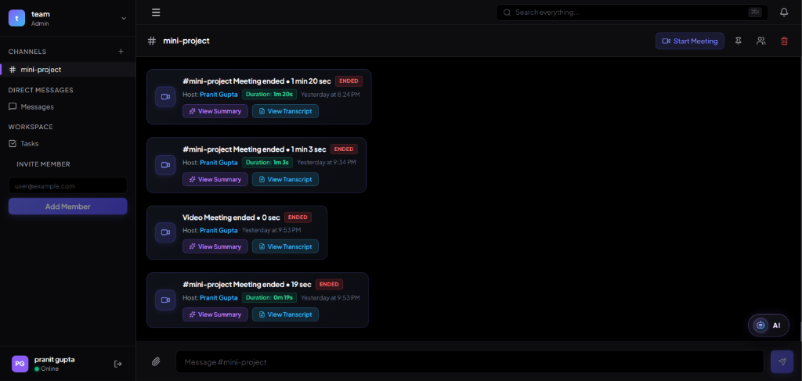
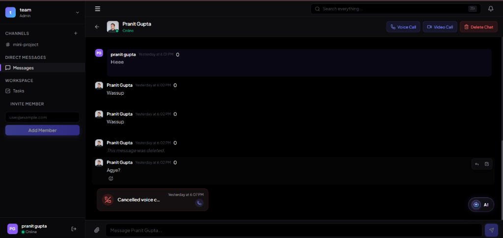
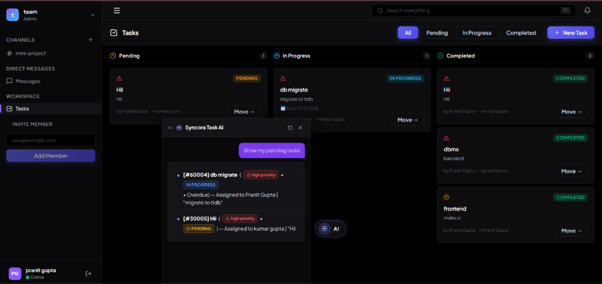
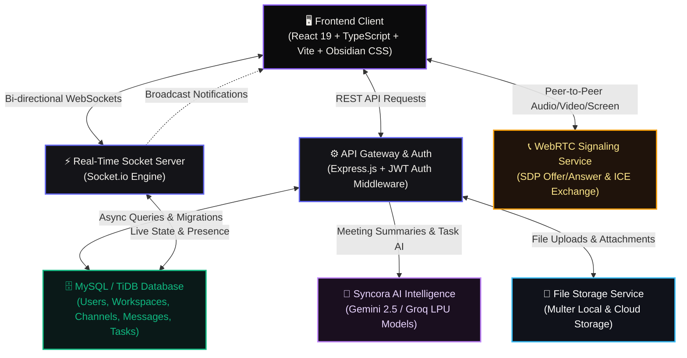
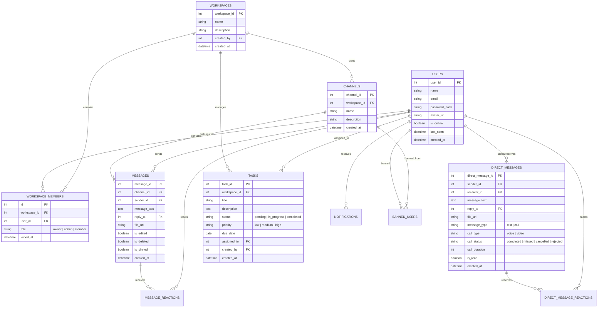

# ⚡ Syncora — Enterprise Real-Time Collaboration & AI Workspace OS

[](https://react.dev/)
[](https://www.typescriptlang.org/)
[](https://vite.dev/)
[](https://nodejs.org/)
[](https://expressjs.com/)
[](https://socket.io/)
[](https://webrtc.org/)
[](https://www.mysql.com/)
[](https://deepmind.google/technologies/gemini/)

---

## 1. Overview

**Syncora** is an enterprise-grade, high-performance real-time collaboration workspace and intelligent team operating system. Designed with an obsidian pitch-black aesthetic and modern glassmorphism, Syncora unifies team chat, multi-party live voice & video meetings, screen sharing, automated meeting intelligence, and task management into a single, cohesive ecosystem.

- **Real-Time Communication**: Instant channel broadcasts and 1-to-1 Direct Messages with typing indicators, read receipts, and live emoji reactions powered by Socket.io.
- **WebRTC Voice, Video & Screen Sharing**: Peer-to-peer 1-to-1 calling and multi-participant channel meetings with ultra-low latency audio, HD video, and screen sharing.
- **AI-Powered Meeting Intelligence**: Automatic generation of comprehensive meeting summaries and word-for-word structured transcripts using cutting-edge LLMs (Gemini / Groq).
- **Interactive Kanban Board & Task AI**: Dynamic drag-and-drop task tracking with conversational AI assistants that query deadlines, summarize workloads, and extract tasks directly from conversation messages.
- **Multi-Tenant Workspaces & Fine-Grained RBAC**: Isolated workspaces, channel permissions, admin moderation, and user bans.
- **Universal Search & Global Telemetry**: Fast full-text search across messages, tasks, channels, and team members with live presence detection.

---

## 2. Application Showcase

### 🌟 1. Channels, Live Meetings & AI Summaries
> Dynamic multi-channel team chat with integrated meeting history cards. Access real-time audio/video meetings, launch screen shares, and review AI-generated meeting summaries and transcripts with a single click.



---

### 💬 2. Direct Messages, Live 1-to-1 Calls & Chat Management
> Private messaging with real-time presence indicators, WhatsApp-style voice and video calling, call log cards, message replies, emoji reactions, and full conversation deletion.



---

### 📋 3. Smart Tasks & Syncora Task AI Assistant
> Interactive Kanban task board categorized by **Pending**, **In Progress**, and **Completed** states. Features conversational Task AI to query pending tasks, track overdue items, and auto-generate tasks from chat messages.



---

## 3. Core Features

### 💬 Real-Time Messaging & Rich Interactions
- **Instant Synchronization**: Sub-50ms message delivery via optimized Socket.io room routing.
- **Emoji Reactions & Pinning**: WhatsApp-style emoji reaction picker and pinned messages tab for critical announcements.
- **Threaded Context**: Quote-replies with automatic smooth scrolling and visual highlighting to original messages.
- **Soft Deletes & In-Line Editing**: Edit sent messages in place or soft-delete with realtime broadcast updates.
- **Conversation Deletion**: Full chat deletion with confirmation modals that permanently removes chat history across both devices.

### 🎥 WebRTC Voice, Video & Screen Sharing
- **1-to-1 Calls**: Instant voice and video call signaling with custom ringers, call timers, and fallback states.
- **Group Channel Meetings**: Multi-participant meetings integrated directly into workspace channels with live banner indicators.
- **Screen Sharing**: One-click native desktop screen sharing (`getDisplayMedia`) with audio streaming.
- **Call Telemetry & History**: Detailed call logs recording duration, status (*completed, missed, cancelled, rejected*), and quick call-back buttons.

### 🤖 AI Meeting Intelligence & Assistant Engine
- **Meeting Summarization**: Automatically distills lengthy audio/video discussions into actionable key takeaways, decisions, and action items.
- **Full Transcripts**: Structured, chronological transcript viewer with speaker breakdown and timestamps.
- **Syncora Task AI**: Floating interactive assistant window that answers natural language questions (e.g. *"Show my pending tasks"*, *"What tasks are overdue?"*).
- **Message-to-Task Extraction**: Convert any chat message into a formal task with auto-filled title, description, and source attribution.

### 📊 Task Management & Kanban Board
- **Three-Stage Workflow**: Seamless status transitions between **Pending**, **In Progress**, and **Completed**.
- **Priority & Due Dates**: High, Medium, Low urgency tags with visual overdue warnings.
- **Assignee Management**: Assign tasks to workspace members with realtime assignment alerts.

### 🏢 Workspaces & Administrative Control
- **Multi-Tenant Architecture**: Create and switch between multiple workspaces seamlessly.
- **Role-Based Access**: Granular roles (`Owner`, `Admin`, `Member`) controlling channel creation, task assignment, and settings.
- **User Moderation**: Ban disruptive users from specific channels or workspaces with automated permission revocation.

---

## 4. System Architecture



---

## 5. Database Entity Relationship (ER) Diagram



---

## 6. How Real-Time Features Work

### 📞 1. WebRTC 1-to-1 Calls & Screen Sharing

```mermaid
sequenceDiagram
    autonumber
    actor Caller as Alice (Caller)
    participant Signaling as Socket.io Server
    actor Callee as Bob (Callee)

    Caller->>Signaling: call_user (offer, type: 'video', receiver: Bob)
    Signaling->>Callee: incoming_call (caller: Alice, offer)
    Callee->>Callee: Plays Ringtone & Displays Call Modal
    Callee->>Signaling: answer_call (answer, caller: Alice)
    Signaling->>Caller: call_accepted (answer)
    
    rect rgb(20, 20, 28)
        note over Caller, Callee: Direct Peer-to-Peer (WebRTC) Media Stream Established
        Caller->>Callee: ICE Candidate Exchange (via Socket)
        Callee->>Caller: ICE Candidate Exchange (via Socket)
        Caller->>Callee: Real-Time Audio + HD Video Stream (DTLS / SRTP)
        Callee->>Caller: Real-Time Audio + HD Video Stream (DTLS / SRTP)
    end

    opt Screen Sharing Toggle
        Caller->>Caller: capture getDisplayMedia()
        Caller->>Callee: replaceTrack(videoTrack)
        note over Caller, Callee: Instant Screen Broadcast without Disconnecting
    end

    Caller->>Signaling: end_call (call_duration)
    Signaling->>Callee: call_ended
    Signaling->>Signaling: Record Call History to Database
```



1. **Signaling Handshake**: When Alice clicks "Voice Call" or "Video Call", her browser generates an **SDP Offer** containing supported codecs and network details. This offer is routed through Socket.io to Bob.
2. **Call Acceptance**: Bob receives an `incoming_call` modal with ringtone audio. Upon clicking accept, Bob's browser creates an **SDP Answer** and dispatches it back to Alice.
3. **ICE Candidate Exchange**: Both peers discover candidate network paths (via STUN servers) and exchange candidates to negotiate the fastest direct peer-to-peer route.
4. **Media Track Swapping (Screen Share)**: When a user shares their screen, `navigator.mediaDevices.getDisplayMedia()` acquires the display stream and replaces the existing camera track on the `RTCRtpSender` seamlessly without restarting the connection.
5. **Call Lifecycle & History**: When a call ends or is rejected, duration and statuses are logged into `direct_messages` as visual call history cards with quick callback shortcuts.

---

### ⚡ 2. Channel & DM Real-Time Messaging

- **Deterministic Room Strategy**:
  - **Channels**: All members join room `channel_{channelId}`. Broadcasts reach only active channel subscribers.
  - **Direct Messages**: Room names are computed deterministically using sorted IDs: `dm_{Math.min(userA, userB)}_{Math.max(userA, userB)}`. Both users automatically converge on the exact same room ID.
  - **User Notification Room**: Each user joins `user_{userId}` on connect to receive real-time unread badges and assignment alerts.
- **Optimistic UI Updates**: Reactions, read receipts, and message state updates render immediately in the client UI and synchronize across peers in under 50ms.

---

### 🤖 3. AI Meeting Summaries & Transcripts

1. **Audio / Context Processing**: During live meetings, discussion points, speaker metadata, and meeting duration are captured.
2. **LLM Synthesis**: The meeting context is passed through Gemini / Groq models with tailored prompt templates for:
   - **Executive Summary**: Core highlights and purpose.
   - **Key Decisions**: Bullet points of agreements made.
   - **Action Items**: Concrete task assignments.
   - **Full Transcript**: Chronological speaker breakdown.
3. **Interactive Modal**: The generated summaries and transcripts are rendered using formatted markdown and syntax highlighting directly in the channel.

---

## 7. Technical Stack

| Layer | Technology | Key Capabilities & Purpose |
| :--- | :--- | :--- |
| **Frontend UI** | React 19, TypeScript, Vite | Ultra-fast client, strict type safety, modular architecture |
| **Styling & Theme** | Obsidian Dark Theme (Custom CSS) | Pitch black palette, glassmorphism, responsive mobile flexbox |
| **Icons & Media** | Lucide React | Clean, scalable vector iconography |
| **Backend Framework** | Node.js, Express.js | High-throughput REST API routing and middleware pipelines |
| **Real-Time Engine** | Socket.io 4.x | Low-latency WebSockets, room management, presence detection |
| **Audio / Video Mesh** | WebRTC Native API | Peer-to-peer audio, video calling, and live screen sharing |
| **Database** | MySQL 8.0 / TiDB Serverless | ACID relational storage, foreign key cascades, migration tooling |
| **AI LLM Inference** | Google Gemini 2.5 & Groq LPU | Meeting summarization, transcript generation, conversational Task AI |
| **Authentication** | JWT (JSON Web Tokens) & BCrypt | Stateless bearer authentication and secure password hashing |
| **File Handling** | Multer | Multi-format file attachments with size and type validation |

---

## 8. Local Setup Guide

### Prerequisites
- **Node.js** (v18.x or higher)
- **npm** or **yarn**
- **MySQL** or **TiDB** instance

---

### 1. Clone the Repository
```bash
git clone https://github.com/gpranit16/syncora.git
cd syncora
```

---

### 2. Configure Database & Migrations
1. Create a MySQL / TiDB database:
   ```sql
   CREATE DATABASE smart_team_collab CHARACTER SET utf8mb4 COLLATE utf8mb4_unicode_ci;
   ```
2. Import the database schema:
   ```bash
   mysql -u root -p smart_team_collab < database/schema.sql
   ```

---

### 3. Setup and Run Backend
```bash
cd backend

# Install dependencies
npm install

# Create environment configuration (.env)
cat <<EOF > .env
PORT=5000
DB_HOST=localhost
DB_USER=root
DB_PASSWORD=your_mysql_password
DB_NAME=smart_team_collab
JWT_SECRET=your_jwt_secret_key_here
GEMINI_API_KEY=your_gemini_api_key_here
EOF

# Start backend server
npm run dev
```

The backend server will launch on `http://localhost:5000`.

---

### 4. Setup and Run Frontend
```bash
cd ../frontend

# Install dependencies
npm install

# Start Vite development server
npm run dev
```

Open your browser and navigate to **`http://localhost:5173`**.

---

## 9. API Reference Overview

| Endpoint | Method | Description |
| :--- | :---: | :--- |
| `/api/auth/register` | `POST` | Register a new user account |
| `/api/auth/login` | `POST` | Authenticate user and obtain JWT token |
| `/api/workspaces/my-workspaces` | `GET` | List all workspaces for authenticated user |
| `/api/channels/workspace/:id` | `GET` | Get all channels belonging to a workspace |
| `/api/messages/channel/:id` | `GET` | Retrieve chat history for a channel |
| `/api/direct-messages/chat/:id` | `GET` | Get DM conversation with specific user |
| `/api/direct-messages/conversation/:id` | `DELETE` | Delete full DM conversation with user |
| `/api/tasks/workspace/:id` | `GET` | Get all Kanban tasks for a workspace |
| `/api/tasks/create` | `POST` | Create a new task with priority and assignee |
| `/api/ai/meeting-summary` | `POST` | Generate AI summary for channel meeting |
| `/api/search?q=query` | `GET` | Global search across messages, tasks, and users |

---

## 10. License

Distributed under the **MIT License**. See `LICENSE` for more information.

---

<div align="center">
  <sub>Built with ❤️ by the Syncora Engineering Team</sub>
</div>
